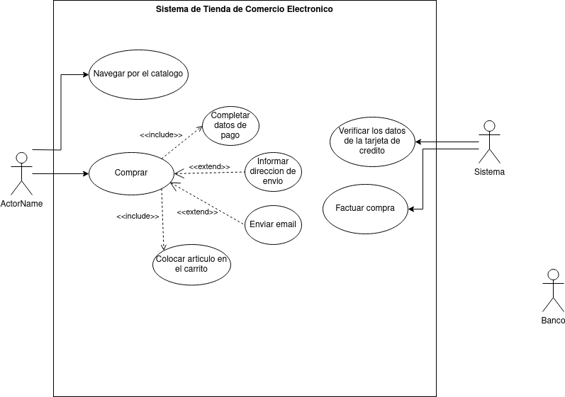

# examenTeorico hecho por franciscorodalf

# Ejercicio 1

# Ejercicio 2
# Especificación de Casos de Uso

## Actores

### Actor: Cliente
| Actor | Cliente |
|---|---|
| **Descripción**  | Representa a los usuarios que interactúan con el sistema VIDEOMAX para alquilar, devolver o reservar películas. |
| **Características**  | Usuario externo que proporciona datos personales, alquila películas, devuelve películas y realiza reservas. |
| **Relaciones** | Comparte acciones con el administrador, como la selección de películas y la interacción con el registro de alquileres o reservas. |
| **Referencias** | Casos de uso relacionados: "Proporciona Datos Personales", "Alquila Película", "Devuelve Película", "Reserva Película". |   
| **Notas** | Debe estar registrado en el sistema para acceder a los servicios. |
| **Autor**  | franciscorodalf |
| **Fecha** | 20 de noviembre de 2024 |

---

### Actor: Administrador VIDEOMAX
| Actor | Administrador VIDEOMAX |
|---|---|
| **Descripción**  | Representa al encargado de gestionar las películas, reservas, alquileres y clientes en el sistema VIDEOMAX. |
| **Características**  | Usuario interno que registra clientes, actualiza proveedores y administra las películas. |
| **Relaciones** | Interactúa directamente con los clientes y el proveedor para garantizar el funcionamiento del sistema. |
| **Referencias** | Casos de uso relacionados: "Registra a los Clientes", "Registra Película", "Registra Alquiler", "Registra Reserva". |   
| **Notas** | Tiene acceso a las funcionalidades administrativas del sistema. |
| **Autor**  | franciscorodalf |
| **Fecha** | 20 de noviembre de 2024 |

---

### Actor: Proveedor
| Actor | Proveedor |
|---|---|
| **Descripción**  | Representa a la entidad que abastece películas al sistema según la disponibilidad. |
| **Características**  | Usuario externo que suministra películas al sistema VIDEOMAX. |
| **Relaciones** | Colabora con el administrador para asegurar la existencia de películas en el catálogo. |
| **Referencias** | Casos de uso relacionados: "Abastece Película Según Existencia", "Abastece Película", "Actualiza Proveedor". |   
| **Notas** | Su rol es clave para mantener el inventario actualizado. |
| **Autor**  | franciscorodalf |
| **Fecha** | 20 de noviembre de 2024 |

---

## Casos de Uso

### Proporciona Datos Personales
| Caso de Uso CU | Proporciona Datos Personales |
|---|---|
| **Fuentes** | Especificación del sistema VIDEOMAX. |
| **Actor** | Cliente |
| **Descripción** | El cliente proporciona sus datos personales para ser registrado en el sistema. |
| **Flujo básico** | 1. El cliente ingresa sus datos personales. 2. El sistema valida la información. 3. El sistema registra al cliente. |
| **Pre-condiciones** | El cliente no debe estar registrado previamente. |
| **Post-condiciones** | Los datos del cliente se guardan en la base de datos. |
| **Requerimientos** | El cliente debe proporcionar información válida (nombre, dirección, etc.). |
| **Notas** | Este paso es necesario para que el cliente pueda realizar otras operaciones en el sistema. |
| **Autor** | franciscorodalf |
| **Fecha** | 20 de noviembre de 2024 |

---

### Alquila Película
| Caso de Uso CU | Alquila Película |
|---|---|
| **Fuentes** | Especificación del sistema VIDEOMAX. |
| **Actor** | Cliente |
| **Descripción** | El cliente selecciona una película y completa el proceso de alquiler. |
| **Flujo básico** | 1. El cliente selecciona la película. 2. El cliente proporciona los datos necesarios. 3. El sistema registra el alquiler. |
| **Pre-condiciones** | El cliente debe estar registrado y la película debe estar disponible. |
| **Post-condiciones** | La película queda marcada como alquilada en el sistema. |
| **Requerimientos** | La película debe estar disponible en el catálogo. |
| **Notas** | El sistema envía un comprobante al cliente tras completar el alquiler. |
| **Autor** | franciscorodalf |
| **Fecha** | 20 de noviembre de 2024 |

---

### Devuelve Película
| Caso de Uso CU | Devuelve Película |
|---|---|
| **Fuentes** | Especificación del sistema VIDEOMAX. |
| **Actor** | Cliente |
| **Descripción** | El cliente devuelve una película previamente alquilada. |
| **Flujo básico** | 1. El cliente entrega la película. 2. El sistema actualiza el estado de la película como disponible. 3. Se registra la devolución en el sistema. |
| **Pre-condiciones** | La película debe haber sido previamente alquilada por el cliente. |
| **Post-condiciones** | La película queda disponible para nuevos alquileres. |
| **Requerimientos** | La película debe estar físicamente devuelta. |
| **Notas** | Si hay retrasos, el sistema puede registrar una multa. |
| **Autor** | franciscorodalf |
| **Fecha** | 20 de noviembre de 2024 |

---

### Reserva Película
| Caso de Uso CU | Reserva Película |
|---|---|
| **Fuentes** | Especificación del sistema VIDEOMAX. |
| **Actor** | Cliente |
| **Descripción** | El cliente reserva una película para garantizar su disponibilidad. |
| **Flujo básico** | 1. El cliente selecciona la película. 2. El sistema verifica la disponibilidad. 3. Se registra la reserva en el sistema. |
| **Pre-condiciones** | La película debe estar disponible para reserva. |
| **Post-condiciones** | La película queda marcada como reservada en el sistema. |
| **Requerimientos** | El cliente debe estar registrado y la película no debe estar alquilada. |
| **Notas** | La reserva tiene una duración limitada antes de expirar. |
| **Autor** | franciscorodalf |
| **Fecha** | 20 de noviembre de 2024 |

---

### Registra Película
| Caso de Uso CU | Registra Película |
|---|---|
| **Fuentes** | Especificación del sistema VIDEOMAX. |
| **Actor** | Administrador VIDEOMAX |
| **Descripción** | El administrador agrega una nueva película al catálogo del sistema. |
| **Flujo básico** | 1. El administrador ingresa los datos de la película. 2. El sistema valida la información. 3. Se registra la película en el catálogo. |
| **Pre-condiciones** | El administrador debe tener acceso al sistema. |
| **Post-condiciones** | La película queda disponible para alquiler o reserva. |
| **Requerimientos** | El sistema debe permitir el ingreso de datos de películas. |
| **Notas** | La información de la película debe ser precisa para evitar errores en el catálogo. |
| **Autor** | franciscorodalf |
| **Fecha** | 20 de noviembre de 2024 |

---

### Abastece Película
| Caso de Uso CU | Abastece Película |
|---|---|
| **Fuentes** | Especificación del sistema VIDEOMAX. |
| **Actor** | Proveedor |
| **Descripción** | El proveedor suministra películas al sistema según la existencia y necesidad del catálogo. |
| **Flujo básico** | 1. El proveedor revisa el inventario. 2. Abastece películas según disponibilidad. 3. El sistema actualiza el inventario. |
| **Pre-condiciones** | El proveedor debe estar registrado en el sistema. |
| **Post-condiciones** | El catálogo se actualiza con las películas abastecidas. |
| **Requerimientos** | Las películas deben ser entregadas físicamente. |
| **Notas** | Este caso de uso garantiza que el sistema tenga suficiente inventario para atender a los clientes. |
| **Autor** | franciscorodalf |
| **Fecha** | 20 de noviembre de 2024 |

---

### Seleccionar Película
| Caso de Uso CU | Seleccionar Película |
|---|---|
| **Fuentes** | Especificación del sistema VIDEOMAX. |
| **Actor** | Cliente |
| **Descripción** | El cliente elige una película del catálogo disponible. |
| **Flujo básico** | 1. El cliente accede al catálogo. 2. Busca una película específica o por categoría. 3. Selecciona la película deseada. |
| **Pre-condiciones** | El cliente debe estar registrado y haber iniciado sesión en el sistema. |
| **Post-condiciones** | La película queda identificada para su alquiler o reserva. |
| **Requerimientos** | El catálogo debe estar actualizado. |
| **Notas** | Este caso de uso es común para las acciones de alquilar y reservar películas. |
| **Autor** | franciscorodalf |
| **Fecha** | 20 de noviembre de 2024 |

---

### Registra Alquiler
| Caso de Uso CU | Registra Alquiler |
|---|---|
| **Fuentes** | Especificación del sistema VIDEOMAX. |
| **Actor** | Administrador VIDEOMAX |
| **Descripción** | El administrador registra el alquiler de una película seleccionada por el cliente. |
| **Flujo básico** | 1. El cliente selecciona la película. 2. El administrador registra la transacción. 3. La película queda marcada como alquilada. |
| **Pre-condiciones** | La película debe estar disponible y el cliente debe haber proporcionado los datos necesarios. |
| **Post-condiciones** | El sistema almacena el registro del alquiler. |
| **Requerimientos** | Sistema funcional y actualizado. |
| **Notas** | Puede incluir detalles como la fecha de devolución esperada. |
| **Autor** | franciscorodalf |
| **Fecha** | 20 de noviembre de 2024 |

---

### Registra Reserva
| Caso de Uso CU | Registra Reserva |
|---|---|
| **Fuentes** | Especificación del sistema VIDEOMAX. |
| **Actor** | Administrador VIDEOMAX |
| **Descripción** | El administrador registra la reserva de una película solicitada por el cliente. |
| **Flujo básico** | 1. El cliente solicita una reserva. 2. El administrador registra la reserva en el sistema. 3. La película queda bloqueada para otros clientes temporalmente. |
| **Pre-condiciones** | La película debe estar disponible y el cliente debe estar registrado. |
| **Post-condiciones** | La reserva queda activa en el sistema. |
| **Requerimientos** | La disponibilidad de la película en el inventario. |
| **Notas** | Las reservas tienen un tiempo límite antes de expirar. |
| **Autor** | franciscorodalf |
| **Fecha** | 20 de noviembre de 2024 |

---

### Actualiza Proveedor
| Caso de Uso CU | Actualiza Proveedor |
|---|---|
| **Fuentes** | Especificación del sistema VIDEOMAX. |
| **Actor** | Administrador VIDEOMAX |
| **Descripción** | El administrador actualiza la información de los proveedores en el sistema. |
| **Flujo básico** | 1. El administrador selecciona un proveedor. 2. Ingresa los datos actualizados. 3. El sistema valida y guarda los cambios. |
| **Pre-condiciones** | El proveedor debe estar previamente registrado en el sistema. |
| **Post-condiciones** | Los datos actualizados quedan reflejados en el sistema. |
| **Requerimientos** | Acceso administrativo al sistema. |
| **Notas** | Es importante mantener los datos actualizados para la gestión del inventario. |
| **Autor** | franciscorodalf |
| **Fecha** | 20 de noviembre de 2024 |

---

### Abastece Película Según Existencia
| Caso de Uso CU | Abastece Película Según Existencia |
|---|---|
| **Fuentes** | Especificación del sistema VIDEOMAX. |
| **Actor** | Proveedor |
| **Descripción** | El proveedor abastece películas en función de las necesidades del inventario. |
| **Flujo básico** | 1. El sistema notifica al proveedor sobre la baja existencia de una película. 2. El proveedor entrega las películas requeridas. 3. El sistema actualiza el inventario. |
| **Pre-condiciones** | El sistema debe monitorear las existencias de películas. |
| **Post-condiciones** | El inventario se actualiza con las nuevas películas. |
| **Requerimientos** | Comunicación activa entre el sistema y el proveedor. |
| **Notas** | Este caso de uso depende de las alertas automáticas del sistema. |
| **Autor** | franciscorodalf |
| **Fecha** | 20 de noviembre de 2024 |

---

### Registra Cliente
| Caso de Uso CU | Registra Cliente |
|---|---|
| **Fuentes** | Documento que sustenta el caso de uso. |
| **Actor** | Administrador |
| **Descripción** | El administrador registra los datos de un cliente en el sistema. |
| **Flujo básico** | 1. El administrador accede al sistema. 2. Proporciona los datos del cliente. 3. El sistema valida y guarda los datos. |
| **Pre-condiciones** | El cliente debe proporcionar toda la información necesaria. |
| **Post-condiciones** | El cliente queda registrado en el sistema. |
| **Requerimientos** | Acceso al sistema administrativo. |
| **Notas** | El sistema verifica si ya existe un cliente con los mismos datos. |
| **Autor** | franciscorodalf |
| **Fecha** | 20 de noviembre de 2024 |
